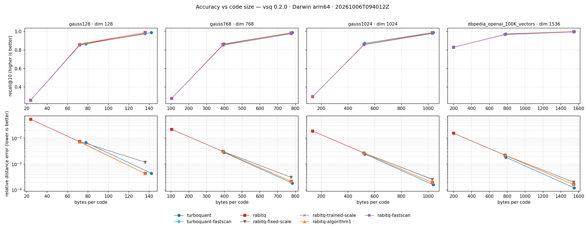
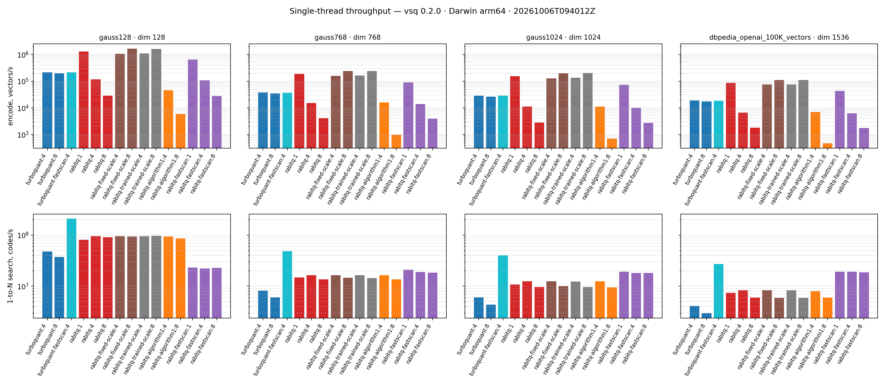

# Benchmarks

Measured accuracy and throughput of `vsq`. The current numbers come from
`python/benchmarks/compare_quantizers.py` on **vsq 0.2.0** (code format v2,
runtime SIMD dispatch, RaBitQ `train()` and `trained_scale`). Everything
under [Earlier runs](#earlier-runs) was measured on the 0.1.x code format and
is kept for history only.

Contributions of numbers from other platforms are welcome — open a PR adding
the CSV under `docs/reports/` and a section below.

---

## vsq 0.2.0 — TurboQuant vs RaBitQ (Apple M3, 2026-10-06)

| | |
|---|---|
| Machine | MacBook Air 15" M3 (4P + 4E, fanless), macOS 15.7, AC power, Low Power Mode off, ISA dispatch `neon` |
| Build | `uv pip install -e .` (Release, `-march=native`), CPython 3.13.7 |
| Threads | 1 for every method (`num_threads=1`): single-core kernel rates |
| Datasets | `gauss128/768/1024`: float32 N(0, 1), seed 1. `dbpedia`: 100K OpenAI embeddings (dim 1536, unit norm) of DBpedia entities from the local, gitignored `python/benchmarks/dbpedia_openai_100K_vectors.npy` (its source model is not recorded; [Qdrant/dbpedia-entities-openai3-text-embedding-3-small-1536-100K](https://huggingface.co/datasets/Qdrant/dbpedia-entities-openai3-text-embedding-3-small-1536-100K) is the same kind of data). Base = first rows, queries = last rows, held out |
| Accuracy | `n_base=20000`, `n_query=500`, `k=10`, exact squared L2 as truth |
| Throughput | `n_speed=20000` codes, 1 query, fastest of 5 repeats after a warmup; 30 s idle before each row and timing before the accuracy pass (`--cooldown 30`), so the fanless CPU is not throttled |
| Raw data | [report](reports/compare_turboquant_rabitq_20261006.md) · [CSV](reports/compare_turboquant_rabitq_20261006.csv) |

Reproduce and redraw:

```bash
uv run python python/benchmarks/compare_quantizers.py \
    --dims 128,768,1024 --data python/benchmarks/dbpedia_openai_100K_vectors.npy \
    --n-base 20000 --n-query 500 --n-speed 20000 --repeats 5 --cooldown 30
uv run python python/benchmarks/plot_compare.py \
    python/benchmarks/results/compare_<stamp>.csv --out-dir docs/img
```

### Configurations

Every quantizer runs at its **most accurate configuration**, which is also
its library default (verified by a sweep over every accuracy knob on all four
datasets, 500 queries):

| quantizer | configuration | knobs that were swept and lost |
|---|---|---|
| TurboQuant | `TurboQuantSpace(dim, bits)` + `train(base)`: IVF centering, 256 k-means centroids, `estimator="corrected"`, no QJL | `qjl=True` (−0.01…−0.06 recall@10 at 4 bits), `estimator="plain"`, `centering="mean"/"none"` (dbpedia 4-bit: 0.970 / 0.944 vs 0.974), `rotation_rounds` 1/5 (noise) |
| RaBitQ | `RaBitQSpace(dim, bits=b)` + `train(base)`: centroid = base mean, `encode_mode` default (`windowed_scale` at 4/8 bits), float query at 1 bit (`query_bits=0`) | zero centroid (dbpedia: 1-bit 0.66, 4-bit 0.938, 8-bit 0.990), `fixed_scale`/`trained_scale` at 8 bits, `query_bits=4` at 1 bit (−0.01…−0.02), `rotation="legacy"` (noise) |
| TurboQuant FastScan | `TurboQuantFastScan(space, codes).search(q, k, rerank=4)` | `rerank=1` (dbpedia 0.968 vs 0.974); `rerank ≥ 2` already equals the flat scan |
| RaBitQ FastScan | `RaBitQFastScan(space, X, eps0=1.9).search(q, k)` on the trained space | `eps0=3.0` refines more codes for ≤ +0.005 recall@10 |

The other RaBitQ rows pin the remaining encode modes for comparison:
`rabitq-fixed-scale` (static), `rabitq-trained-scale` (trained) and
`rabitq-algorithm1` (the exact reference). See
[RaBitQ encode modes](../README.md#encode-modes-4-and-8-bits) for what each
one does.

### Accuracy vs code size



### Throughput



### Results

`bytes` is the stored code per vector (float32 is `4·dim`). `rel_mae` is the
mean relative error of the asymmetric squared-L2 estimate; FastScan rows
return top-k ids only, so it is undefined there (—). `encode` is vectors/s
through `encode_batch` (FastScan: building the index from vectors). `search`
is codes scanned per second for one query: `distance_1_to_n` for flat rows,
the index's full top-k `search` (scan, selection and re-ranking) for
FastScan rows.

| dataset | method | bits | dim | bytes | recall@1 | recall@10 | rel_mae | encode vec/s | search codes/s |
|---|---|---:|---:|---:|---:|---:|---:|---:|---:|
| gauss128 | turboquant | 4 | 128 | 78 | 0.800 | 0.8662 | 0.0068 | 212,995 | 47,412,015 |
| gauss128 | turboquant | 8 | 128 | 142 | 0.982 | 0.9880 | 0.0004 | 198,424 | 37,330,845 |
| gauss128 | turboquant-fastscan | 4 | 128 | 78 | 0.800 | 0.8662 | — | 215,402 | 209,150,330 |
| gauss128 | rabitq | 1 | 128 | 24 | 0.188 | 0.2580 | 0.0533 | 1,312,950 | 80,794,697 |
| gauss128 | rabitq | 4 | 128 | 72 | 0.810 | 0.8586 | 0.0072 | 118,927 | 95,503,686 |
| gauss128 | rabitq | 8 | 128 | 136 | 0.986 | 0.9898 | 0.0004 | 28,490 | 90,737,102 |
| gauss128 | rabitq-fixed-scale | 4 | 128 | 72 | 0.818 | 0.8586 | 0.0074 | 1,080,903 | 95,106,305 |
| gauss128 | rabitq-fixed-scale | 8 | 128 | 136 | 0.956 | 0.9740 | 0.0012 | 1,669,809 | 94,117,647 |
| gauss128 | rabitq-trained-scale | 4 | 128 | 72 | 0.818 | 0.8584 | 0.0074 | 1,088,004 | 94,955,490 |
| gauss128 | rabitq-trained-scale | 8 | 128 | 136 | 0.958 | 0.9748 | 0.0012 | 1,634,382 | 96,308,031 |
| gauss128 | rabitq-algorithm1 | 4 | 128 | 72 | 0.786 | 0.8652 | 0.0070 | 46,232 | 93,403,386 |
| gauss128 | rabitq-algorithm1 | 8 | 128 | 136 | 0.986 | 0.9898 | 0.0004 | 5,985 | 85,929,108 |
| gauss128 | rabitq-fastscan | 1 | 128 | 24 | 0.188 | 0.2580 | — | 648,121 | 23,330,417 |
| gauss128 | rabitq-fastscan | 4 | 128 | 72 | 0.806 | 0.8526 | — | 108,659 | 22,041,604 |
| gauss128 | rabitq-fastscan | 8 | 128 | 136 | 0.982 | 0.9804 | — | 27,909 | 22,917,173 |
| gauss768 | turboquant | 4 | 768 | 398 | 0.840 | 0.8652 | 0.0028 | 37,636 | 8,258,065 |
| gauss768 | turboquant | 8 | 768 | 782 | 0.992 | 0.9890 | 0.0002 | 34,436 | 6,067,501 |
| gauss768 | turboquant-fastscan | 4 | 768 | 398 | 0.840 | 0.8652 | — | 37,096 | 48,524,021 |
| gauss768 | rabitq | 1 | 768 | 104 | 0.186 | 0.2774 | 0.0217 | 187,497 | 14,724,830 |
| gauss768 | rabitq | 4 | 768 | 392 | 0.832 | 0.8566 | 0.0031 | 15,338 | 16,395,687 |
| gauss768 | rabitq | 8 | 768 | 776 | 0.994 | 0.9854 | 0.0002 | 4,100 | 13,549,364 |
| gauss768 | rabitq-fixed-scale | 4 | 768 | 392 | 0.820 | 0.8614 | 0.0031 | 159,947 | 16,450,751 |
| gauss768 | rabitq-fixed-scale | 8 | 768 | 776 | 0.982 | 0.9814 | 0.0003 | 240,796 | 14,595,877 |
| gauss768 | rabitq-trained-scale | 4 | 768 | 392 | 0.828 | 0.8594 | 0.0031 | 162,485 | 16,458,657 |
| gauss768 | rabitq-trained-scale | 8 | 768 | 776 | 0.978 | 0.9816 | 0.0003 | 243,149 | 14,485,752 |
| gauss768 | rabitq-algorithm1 | 4 | 768 | 392 | 0.834 | 0.8564 | 0.0031 | 16,226 | 16,491,445 |
| gauss768 | rabitq-algorithm1 | 8 | 768 | 776 | 0.994 | 0.9854 | 0.0002 | 984 | 13,563,543 |
| gauss768 | rabitq-fastscan | 1 | 768 | 104 | 0.186 | 0.2774 | — | 91,514 | 21,002,888 |
| gauss768 | rabitq-fastscan | 4 | 768 | 392 | 0.830 | 0.8520 | — | 14,010 | 18,924,466 |
| gauss768 | rabitq-fastscan | 8 | 768 | 776 | 0.992 | 0.9748 | — | 3,887 | 18,425,402 |
| gauss1024 | turboquant | 4 | 1024 | 526 | 0.874 | 0.8724 | 0.0024 | 28,928 | 6,073,720 |
| gauss1024 | turboquant | 8 | 1024 | 1038 | 0.992 | 0.9902 | 0.0002 | 26,486 | 4,375,850 |
| gauss1024 | turboquant-fastscan | 4 | 1024 | 526 | 0.874 | 0.8724 | — | 28,505 | 40,268,429 |
| gauss1024 | rabitq | 1 | 1024 | 136 | 0.172 | 0.2966 | 0.0188 | 153,890 | 10,854,569 |
| gauss1024 | rabitq | 4 | 1024 | 520 | 0.838 | 0.8596 | 0.0027 | 11,176 | 12,456,853 |
| gauss1024 | rabitq | 8 | 1024 | 1032 | 0.990 | 0.9872 | 0.0002 | 2,837 | 9,610,376 |
| gauss1024 | rabitq-fixed-scale | 4 | 1024 | 520 | 0.814 | 0.8606 | 0.0027 | 127,727 | 12,427,509 |
| gauss1024 | rabitq-fixed-scale | 8 | 1024 | 1032 | 0.988 | 0.9846 | 0.0003 | 200,569 | 10,006,464 |
| gauss1024 | rabitq-trained-scale | 4 | 1024 | 520 | 0.812 | 0.8614 | 0.0027 | 133,405 | 12,287,533 |
| gauss1024 | rabitq-trained-scale | 8 | 1024 | 1032 | 0.986 | 0.9822 | 0.0003 | 205,760 | 9,650,954 |
| gauss1024 | rabitq-algorithm1 | 4 | 1024 | 520 | 0.838 | 0.8588 | 0.0027 | 11,336 | 12,493,823 |
| gauss1024 | rabitq-algorithm1 | 8 | 1024 | 1032 | 0.990 | 0.9872 | 0.0002 | 716 | 9,522,866 |
| gauss1024 | rabitq-fastscan | 1 | 1024 | 136 | 0.172 | 0.2966 | — | 74,074 | 19,121,227 |
| gauss1024 | rabitq-fastscan | 4 | 1024 | 520 | 0.838 | 0.8568 | — | 10,038 | 18,036,965 |
| gauss1024 | rabitq-fastscan | 8 | 1024 | 1032 | 0.990 | 0.9780 | — | 2,739 | 18,107,053 |
| dbpedia | turboquant | 4 | 1536 | 782 | 0.968 | 0.9742 | 0.0018 | 18,741 | 4,088,168 |
| dbpedia | turboquant | 8 | 1536 | 1550 | 1.000 | 0.9988 | 0.0001 | 17,246 | 2,938,530 |
| dbpedia | turboquant-fastscan | 4 | 1536 | 782 | 0.968 | 0.9742 | — | 18,538 | 27,137,042 |
| dbpedia | rabitq | 1 | 1536 | 200 | 0.814 | 0.8304 | 0.0154 | 87,533 | 7,444,054 |
| dbpedia | rabitq | 4 | 1536 | 776 | 0.964 | 0.9684 | 0.0022 | 6,635 | 8,342,458 |
| dbpedia | rabitq | 8 | 1536 | 1544 | 1.000 | 0.9990 | 0.0002 | 1,799 | 5,960,438 |
| dbpedia | rabitq-fixed-scale | 4 | 1536 | 776 | 0.962 | 0.9694 | 0.0022 | 74,445 | 8,331,310 |
| dbpedia | rabitq-fixed-scale | 8 | 1536 | 1544 | 0.998 | 0.9984 | 0.0002 | 110,467 | 5,940,080 |
| dbpedia | rabitq-trained-scale | 4 | 1536 | 776 | 0.960 | 0.9694 | 0.0022 | 74,609 | 8,363,826 |
| dbpedia | rabitq-trained-scale | 8 | 1536 | 1544 | 0.998 | 0.9972 | 0.0002 | 109,801 | 5,913,369 |
| dbpedia | rabitq-algorithm1 | 4 | 1536 | 776 | 0.964 | 0.9686 | 0.0022 | 7,029 | 7,931,787 |
| dbpedia | rabitq-algorithm1 | 8 | 1536 | 1544 | 1.000 | 0.9990 | 0.0002 | 471 | 5,958,588 |
| dbpedia | rabitq-fastscan | 1 | 1536 | 200 | 0.814 | 0.8304 | — | 43,092 | 19,214,603 |
| dbpedia | rabitq-fastscan | 4 | 1536 | 776 | 0.964 | 0.9664 | — | 6,275 | 19,125,030 |
| dbpedia | rabitq-fastscan | 8 | 1536 | 1544 | 1.000 | 0.9946 | — | 1,769 | 18,707,621 |

### What to take away

- **Accuracy: a tie at equal code size; TurboQuant slightly ahead at 4
  bits.** On dbpedia, recall@10 is 0.974 (TurboQuant) vs 0.968 (RaBitQ) at
  4 bits and 0.9988 vs 0.9990 at 8 bits. On N(0, 1) the 4-bit gap is
  0.008–0.013 in TurboQuant's favour; 8 bits are within 0.004. TurboQuant
  codes are 6 bytes longer (IVF fields `f_ct` and `cid`). With 500 queries
  a recall@10 difference below ~0.005 is sampling noise.
- **Why RaBitQ used to look more accurate.** The 2026-10-03 runs (0.1.0)
  compared an older TurboQuant (single SRHT, no centering) against the
  RaBitQ Algorithm 1 sweep on 40 queries; RaBitQ won by ~0.05 at 4 bits.
  With 0.2.0 TurboQuant (block rotation + IVF) and both quantizers at their
  best settings, the gap is gone.
- **The centroid matters more than the RaBitQ encode mode.** Without
  `train()` (zero centroid) RaBitQ on dbpedia drops to 0.938 at 4 bits and
  0.66 at 1 bit. Among encode modes, `windowed_scale` (default) equals the
  exact `algorithm1`; `fixed_scale` and `trained_scale` match it at 4 bits
  but lose at 8 bits on N(0, 1) (0.974 vs 0.990 at dim 128).
- **`trained_scale` ≈ `fixed_scale`.** Its data-calibrated scale is within
  ~1% of the static N(0, 1) one, and recall and encode speed are the same:
  after the random rotation residual coordinates are near N(0, 1/D)
  whatever the data.
- **TurboQuant FastScan is the fastest scan, with no recall loss.**
  `TurboQuantFastScan` (`rerank=4`) has the same recall as the flat scan
  and scans 27–209 M codes/s: 4.4× the flat TurboQuant scan at dim 128 and
  6.6× at 1024–1536, 2.2–3.3× RaBitQ's flat scan, and 1.4–9.5× RaBitQ
  FastScan (4-bit).
- **RaBitQ flat scan is ~2× TurboQuant's.** `distance_1_to_n` single-thread:
  RaBitQ is 2.0× faster at 4 bits and 2.0–2.4× at 8 bits.
- **RaBitQ FastScan pays off from mid dimensions.** Its 1-bit first stage
  scans 18–23 M codes/s almost independently of dim and refines 0.1–5% of
  the base with the full code. At dim 128 it is 4× slower than RaBitQ's
  flat scan; at 1536 it is 2.3× (4-bit) to 3.1× (8-bit) faster. Recall@10 is within 0.006 of the
  flat scan at 4 bits and 0.004–0.011 below it at 8 bits (bound pruning at
  `eps0=1.9`).
- **RaBitQ encode cost is set by its mode.** The
  default `windowed_scale` encodes at 0.35–0.56× TurboQuant's rate at 4
  bits and 0.10–0.14× at 8 bits. The static `fixed_scale` / `trained_scale`
  encode 4–5× faster than TurboQuant at 4 bits and 6–8× at 8 bits (9–11×
  faster than `windowed_scale` at 4 bits, 60–70× at 8 bits). `algorithm1`
  at 8 bits is 470–6,000 vectors/s — reference only. TurboQuant encode is
  dominated by the search for the nearest of 256 IVF centroids.
- **No power-of-two padding tax.** v2 pads to a multiple of 64, so dim 768 is
  encoded as is: TurboQuant 4-bit codes are 398 bytes instead of 526, and
  search is 1.36× faster than at 1024.

---

## How the comparison is measured

`compare_quantizers.py` writes a CSV and a Markdown table under
`python/benchmarks/results/` (gitignored); `plot_compare.py` turns the CSV
into the two figures above. Every row of a dataset sees the same base,
queries and timing vectors, so rows differ by quantizer, bit width and
search API only.

- **Accuracy.** recall@k is the overlap of the predicted top-k with the exact
  squared-L2 top-k (float64). Per-pair rows rank all `n_base` estimates from
  `distance_1_to_n`; FastScan rows use the index's own `search()`.
  `rel_mae` averages `|d̂ − d| / d` over all pairs (per-pair rows only).
- **Throughput.** Fastest of `--repeats` calls after one warmup, single
  thread (`num_threads=1` on both spaces; the library default `0` uses every
  core). Training (TurboQuant k-means, RaBitQ centroid and `trained_scale`
  calibration) runs once on the accuracy base, outside any timed region.
- **Thermals and power.** On laptops, check `pmset -g` (macOS) before a run:
  Low Power Mode on battery lowered every rate here by ~1.7×, and a fanless
  M3 throttles after a few minutes of sustained load, which showed up as up
  to 1.6× spread between RaBitQ rows that share one search kernel.
  `--cooldown 30` idles before each row's timing and times before the
  accuracy pass; with it the shared-kernel rows agree within ~5%.
- **Sizes.** The script defaults (`n_base=2000`, `n_query=40`,
  `n_speed=400`) are a quick check: with 400 codes the search timing is tens
  of microseconds and noisy, and TurboQuant `train()` on 2,000 vectors fits
  `min(256, n/39)` ≈ 51 centroids, which makes its encode ~3× faster than
  with the full 256. Use the sizes above for published numbers.

Method tokens (`method:bits`): `turboquant:4|8`, `turboquant-fastscan:4`,
`rabitq:1|4|8` (library default mode), `rabitq-fixed-scale:4|8`,
`rabitq-windowed-scale:4|8`, `rabitq-trained-scale:4|8`,
`rabitq-algorithm1:1|4|8`, `rabitq-fastscan:1|4|8`. Other flags:
`--data PATH.npy` (repeatable; `--dims none` skips the Gaussian sets),
`--rabitq-centroid mean|none`, `--rabitq-query-bits` (1-bit query),
`--rerank`, `--eps0`, `--cooldown`. `--quick` is a smoke preset.

---

## Earlier runs

Measured on the **0.1.x code format** (single SRHT, no IVF centering, dims
padded to a power of two). Not comparable with the 0.2.0 numbers above.

- **2026-10-03, TurboQuant vs RaBitQ** (turboquant 0.1.0, Darwin arm64,
  N(0, 1) only, `n_base=2000`, `n_query=40`, `n_speed=400`, RaBitQ with a
  zero centroid).
  - Algorithm 1 sweep, stamp `20261003T134329Z`:
    [report](reports/compare_turboquant_rabitq_20261003.md),
    [CSV](reports/compare_turboquant_rabitq_20261003.csv).
    The `rabitq` rows at 4 and 8 bits in that file are the sweep, not the
    current 4/8-bit default.
  - Encode-mode comparison, stamp `20261003T194028Z`:
    [report](reports/compare_turboquant_rabitq_encode_20261003.md),
    [CSV](reports/compare_turboquant_rabitq_encode_20261003.csv).
    Names in that file were aligned with the API after the run.
- **2026-04-12, Apple M3 kernel microbenchmark** (turboquant 0.1.x,
  `python/tests/performance_check.py`, since removed). Asymmetric and
  symmetric distance and encode rates over dims 128–4096 and batches
  1–10,000, expanded below.

<details>
<summary>Apple M3 microbenchmark tables, 0.1.x (2026-04-12)</summary>

All distance rows report **distances/sec**, so asymmetric and symmetric
paths compare per pair computed. Encoding rows report **vectors/sec**.

### Distance modes — what the rows mean

`TurboQuantSpace` exposes two distance paths, differing only in whether
the **query** side is already quantized. There is no third "code vs float"
mode: the asymmetric kernel is symmetric in its roles, and quantizing a
query against a raw-float database would throw away precision without
saving memory.

| mode    | methods                                                     | query            | database | when to use                                                                                              |
|---------|-------------------------------------------------------------|------------------|----------|----------------------------------------------------------------------------------------------------------|
| **asym**| `distance_1_to_n`, `distance_m_to_n`, `distance`            | float32 (raw)    | code     | query arrives from outside in full precision — typical online search: a request comes in, scan the index |
| **sym** | `distance_m_to_n_symmetric`, `distance_symmetric`           | code             | code     | both sides already live in the index as codes — dedup, clustering, pairwise similarity within the base   |

A separate "fp32 baseline" (plain `np.dot(Q, X.T)`) is the reference for
"how fast would this be without quantization at all" — useful to quote
alongside, but it is not a turboquant path.

**Why sym is usually faster per distance.** The sym kernel operates on
two uint8 code streams with popcount-/XOR-style SIMD — no rotation, no
LUT, no float arithmetic in the hot loop. Asym has to apply the
Walsh–Hadamard rotation to the float query and evaluate the Lloyd–Max
lookup against each code. On tiny batches (`n < ~500`) sym loses to asym
because its `n²` work can't amortize the per-call overhead; on larger
batches sym pulls ahead sharply, and for `dim=128` hits ~140M distances/sec.

#### Reading the `Time` column — work is not the same shape

The two distance rows answer **different questions**, even though
`Throughput (dist/s)` is directly comparable between them:

- **`1-to-N (asym)`** measures the realistic online-search path: one
  float query against `N` codes in the base. Work is `O(N)`, so at
  `N=10000` the kernel computes **10⁴ pairs**.
- **`M-to-N (sym)`** measures the realistic matrix path: every code in
  an `M`-set vs every code in an `N`-set — dedup, clustering, full kNN
  graph. Work is `O(M·N)`, so at `M=N=10000` the kernel computes
  **10⁸ pairs — 10,000× more than the asym row on the same line**.

That is why the `Time` column looks wildly different for the two modes
at large batches: `1024/10000 asym` spends 0.68 ms on 10⁴ pairs
(~14.7M dist/s), and `1024/10000 sym` spends 6010 ms on 10⁸ pairs
(~16.6M dist/s). **Per-distance throughput is within ~15% of each
other** — the wall-clock gap is purely the quadratic `M·N` shape of the
sym benchmark, not extra work per pair or query conversion overhead
(encoding is measured separately and costs ~13 ms for 10k vectors at
`dim=1024`).

If you want a wall-clock number for "symmetric, one query against N",
read the asym row and treat it as a lower bound — the sym kernel on a
`1×N` shape is faster per pair, not slower.


### Apple M3 (macOS, arm64, NEON)

- **CPU:** Apple M3
- **Build:** `-march=native`, OpenMP via `brew install libomp`
- **Python:** CPython 3.12
- **Date:** 2026-04-12

#### bits_per_coord = 4

|  Dim | Batch |         Task | Time (ms) |      Throughput |   Unit |
|-----:|------:|-------------:|----------:|----------------:|-------:|
|  128 |     1 |     Encoding |      0.00 |         875,913 |  vec/s |
|  128 |     1 | 1-to-N (asym)|      0.00 |       1,270,849 | dist/s |
|  128 |    50 |     Encoding |      0.04 |       1,237,591 |  vec/s |
|  128 |    50 | 1-to-N (asym)|      0.00 |      20,915,035 | dist/s |
|  128 |    50 |  M-to-N (sym)|      0.08 |      30,481,223 | dist/s |
|  128 |   100 |     Encoding |      0.04 |       2,393,871 |  vec/s |
|  128 |   100 | 1-to-N (asym)|      0.03 |       2,971,602 | dist/s |
|  128 |   100 |  M-to-N (sym)|      0.11 |      91,277,136 | dist/s |
|  128 |  1000 |     Encoding |      0.21 |       4,761,928 |  vec/s |
|  128 |  1000 | 1-to-N (asym)|      0.03 |      36,153,838 | dist/s |
|  128 |  1000 |  M-to-N (sym)|      8.21 |     121,784,755 | dist/s |
|  128 |  5000 |     Encoding |      0.99 |       5,075,310 |  vec/s |
|  128 |  5000 | 1-to-N (asym)|      0.06 |      83,388,341 | dist/s |
|  128 |  5000 |  M-to-N (sym)|    190.18 |     131,451,790 | dist/s |
|  128 | 10000 |     Encoding |      1.78 |       5,619,314 |  vec/s |
|  128 | 10000 | 1-to-N (asym)|      0.10 |     101,464,683 | dist/s |
|  128 | 10000 |  M-to-N (sym)|    723.71 |     138,177,140 | dist/s |
|  512 |     1 |     Encoding |      0.00 |         311,162 |  vec/s |
|  512 |     1 | 1-to-N (asym)|      0.00 |         635,762 | dist/s |
|  512 |    50 |     Encoding |      0.14 |         348,283 |  vec/s |
|  512 |    50 | 1-to-N (asym)|      0.01 |       6,770,480 | dist/s |
|  512 |    50 |  M-to-N (sym)|      0.31 |       7,990,817 | dist/s |
|  512 |   100 |     Encoding |      0.09 |       1,096,764 |  vec/s |
|  512 |   100 | 1-to-N (asym)|      0.02 |       4,899,309 | dist/s |
|  512 |   100 |  M-to-N (sym)|      0.33 |      30,343,245 | dist/s |
|  512 |  1000 |     Encoding |      0.62 |       1,606,761 |  vec/s |
|  512 |  1000 | 1-to-N (asym)|      0.05 |      18,630,213 | dist/s |
|  512 |  1000 |  M-to-N (sym)|     31.08 |      32,170,460 | dist/s |
|  512 |  5000 |     Encoding |      3.49 |       1,431,145 |  vec/s |
|  512 |  5000 | 1-to-N (asym)|      0.18 |      27,114,416 | dist/s |
|  512 |  5000 |  M-to-N (sym)|    808.71 |      30,913,488 | dist/s |
|  512 | 10000 |     Encoding |      7.06 |       1,416,853 |  vec/s |
|  512 | 10000 | 1-to-N (asym)|      0.40 |      24,901,431 | dist/s |
|  512 | 10000 |  M-to-N (sym)|   3071.30 |      32,559,451 | dist/s |
|  768 |     1 |     Encoding |      0.01 |         160,267 |  vec/s |
|  768 |     1 | 1-to-N (asym)|      0.00 |         365,158 | dist/s |
|  768 |    50 |     Encoding |      0.29 |         173,421 |  vec/s |
|  768 |    50 | 1-to-N (asym)|      0.01 |       3,422,558 | dist/s |
|  768 |    50 |  M-to-N (sym)|      0.65 |       3,859,152 | dist/s |
|  768 |   100 |     Encoding |      0.17 |         583,462 |  vec/s |
|  768 |   100 | 1-to-N (asym)|      0.03 |       3,845,753 | dist/s |
|  768 |   100 |  M-to-N (sym)|      0.60 |      16,634,918 | dist/s |
|  768 |  1000 |     Encoding |      1.30 |         767,936 |  vec/s |
|  768 |  1000 | 1-to-N (asym)|      0.09 |      10,938,250 | dist/s |
|  768 |  1000 |  M-to-N (sym)|     59.77 |      16,730,334 | dist/s |
|  768 |  5000 |     Encoding |      7.59 |         658,881 |  vec/s |
|  768 |  5000 | 1-to-N (asym)|      0.36 |      13,711,898 | dist/s |
|  768 |  5000 |  M-to-N (sym)|   1549.77 |      16,131,451 | dist/s |
|  768 | 10000 |     Encoding |     12.41 |         805,597 |  vec/s |
|  768 | 10000 | 1-to-N (asym)|      0.68 |      14,713,120 | dist/s |
|  768 | 10000 |  M-to-N (sym)|   5963.25 |      16,769,366 | dist/s |
| 1024 |     1 |     Encoding |      0.01 |         161,155 |  vec/s |
| 1024 |     1 | 1-to-N (asym)|      0.00 |         357,515 | dist/s |
| 1024 |    50 |     Encoding |      0.29 |         173,225 |  vec/s |
| 1024 |    50 | 1-to-N (asym)|      0.01 |       3,357,301 | dist/s |
| 1024 |    50 |  M-to-N (sym)|      0.64 |       3,934,821 | dist/s |
| 1024 |   100 |     Encoding |      0.18 |         564,606 |  vec/s |
| 1024 |   100 | 1-to-N (asym)|      0.03 |       3,906,663 | dist/s |
| 1024 |   100 |  M-to-N (sym)|      0.63 |      15,907,474 | dist/s |
| 1024 |  1000 |     Encoding |      1.24 |         808,163 |  vec/s |
| 1024 |  1000 | 1-to-N (asym)|      0.09 |      11,486,578 | dist/s |
| 1024 |  1000 |  M-to-N (sym)|     60.56 |      16,513,344 | dist/s |
| 1024 |  5000 |     Encoding |      6.58 |         759,587 |  vec/s |
| 1024 |  5000 | 1-to-N (asym)|      0.37 |      13,462,208 | dist/s |
| 1024 |  5000 |  M-to-N (sym)|   1604.55 |      15,580,689 | dist/s |
| 1024 | 10000 |     Encoding |     12.79 |         782,074 |  vec/s |
| 1024 | 10000 | 1-to-N (asym)|      0.68 |      14,754,773 | dist/s |
| 1024 | 10000 |  M-to-N (sym)|   6010.79 |      16,636,755 | dist/s |
| 2048 |     1 |     Encoding |      0.01 |          80,050 |  vec/s |
| 2048 |     1 | 1-to-N (asym)|      0.01 |         182,342 | dist/s |
| 2048 |    50 |     Encoding |      0.58 |          86,233 |  vec/s |
| 2048 |    50 | 1-to-N (asym)|      0.03 |       1,760,421 | dist/s |
| 2048 |    50 |  M-to-N (sym)|      1.25 |       1,996,675 | dist/s |
| 2048 |   100 |     Encoding |      0.28 |         352,524 |  vec/s |
| 2048 |   100 | 1-to-N (asym)|      0.03 |       2,876,990 | dist/s |
| 2048 |   100 |  M-to-N (sym)|      1.17 |       8,557,185 | dist/s |
| 2048 |  1000 |     Encoding |      2.61 |         383,630 |  vec/s |
| 2048 |  1000 | 1-to-N (asym)|      0.20 |       4,990,704 | dist/s |
| 2048 |  1000 |  M-to-N (sym)|    123.79 |       8,078,218 | dist/s |
| 2048 |  5000 |     Encoding |     15.17 |         329,512 |  vec/s |
| 2048 |  5000 | 1-to-N (asym)|      0.66 |       7,588,608 | dist/s |
| 2048 |  5000 |  M-to-N (sym)|   3068.60 |       8,147,030 | dist/s |
| 2048 | 10000 |     Encoding |     27.55 |         363,005 |  vec/s |
| 2048 | 10000 | 1-to-N (asym)|      1.31 |       7,631,888 | dist/s |
| 2048 | 10000 |  M-to-N (sym)|  12099.89 |       8,264,540 | dist/s |
| 4096 |     1 |     Encoding |      0.02 |          41,768 |  vec/s |
| 4096 |     1 | 1-to-N (asym)|      0.01 |          97,779 | dist/s |
| 4096 |    50 |     Encoding |      1.17 |          42,588 |  vec/s |
| 4096 |    50 | 1-to-N (asym)|      0.06 |         883,187 | dist/s |
| 4096 |    50 |  M-to-N (sym)|      2.51 |         996,668 | dist/s |
| 4096 |   100 |     Encoding |      0.52 |         193,264 |  vec/s |
| 4096 |   100 | 1-to-N (asym)|      0.06 |       1,739,155 | dist/s |
| 4096 |   100 |  M-to-N (sym)|      2.43 |       4,108,145 | dist/s |
| 4096 |  1000 |     Encoding |      5.46 |         183,047 |  vec/s |
| 4096 |  1000 | 1-to-N (asym)|      0.27 |       3,657,629 | dist/s |
| 4096 |  1000 |  M-to-N (sym)|    253.19 |       3,949,562 | dist/s |
| 4096 |  5000 |     Encoding |     25.54 |         195,804 |  vec/s |
| 4096 |  5000 | 1-to-N (asym)|      1.22 |       4,101,840 | dist/s |
| 4096 |  5000 |  M-to-N (sym)|   6033.86 |       4,143,286 | dist/s |
| 4096 | 10000 |     Encoding |     53.03 |         188,577 |  vec/s |
| 4096 | 10000 | 1-to-N (asym)|      2.27 |       4,409,264 | dist/s |
| 4096 | 10000 |  M-to-N (sym)|  24765.24 |       4,037,917 | dist/s |

#### bits_per_coord = 8

|  Dim | Batch |         Task | Time (ms) |      Throughput |   Unit |
|-----:|------:|-------------:|----------:|----------------:|-------:|
|  128 |     1 |     Encoding |      0.00 |         549,073 |  vec/s |
|  128 |     1 | 1-to-N (asym)|      0.00 |       1,255,232 | dist/s |
|  128 |    50 |     Encoding |      0.07 |         696,821 |  vec/s |
|  128 |    50 | 1-to-N (asym)|      0.00 |      20,093,757 | dist/s |
|  128 |    50 |  M-to-N (sym)|      0.13 |      18,650,424 | dist/s |
|  128 |   100 |     Encoding |      0.06 |       1,757,829 |  vec/s |
|  128 |   100 | 1-to-N (asym)|      0.02 |       5,703,693 | dist/s |
|  128 |   100 |  M-to-N (sym)|      0.17 |      58,099,282 | dist/s |
|  128 |  1000 |     Encoding |      0.35 |       2,850,432 |  vec/s |
|  128 |  1000 | 1-to-N (asym)|      0.03 |      37,093,989 | dist/s |
|  128 |  1000 |  M-to-N (sym)|     13.62 |      73,429,919 | dist/s |
|  128 |  5000 |     Encoding |      1.65 |       3,027,299 |  vec/s |
|  128 |  5000 | 1-to-N (asym)|      0.07 |      67,068,145 | dist/s |
|  128 |  5000 |  M-to-N (sym)|    361.13 |      69,226,221 | dist/s |
|  128 | 10000 |     Encoding |      3.47 |       2,885,256 |  vec/s |
|  128 | 10000 | 1-to-N (asym)|      0.13 |      74,511,023 | dist/s |
|  128 | 10000 |  M-to-N (sym)|   1330.04 |      75,185,496 | dist/s |
|  512 |     1 |     Encoding |      0.01 |         150,065 |  vec/s |
|  512 |     1 | 1-to-N (asym)|      0.00 |         546,261 | dist/s |
|  512 |    50 |     Encoding |      0.28 |         179,801 |  vec/s |
|  512 |    50 | 1-to-N (asym)|      0.01 |       6,219,064 | dist/s |
|  512 |    50 |  M-to-N (sym)|      0.57 |       4,364,413 | dist/s |
|  512 |   100 |     Encoding |      0.16 |         611,451 |  vec/s |
|  512 |   100 | 1-to-N (asym)|      0.02 |       4,787,170 | dist/s |
|  512 |   100 |  M-to-N (sym)|      0.50 |      20,184,719 | dist/s |
|  512 |  1000 |     Encoding |      1.39 |         717,550 |  vec/s |
|  512 |  1000 | 1-to-N (asym)|      0.07 |      14,672,258 | dist/s |
|  512 |  1000 |  M-to-N (sym)|     52.86 |      18,919,432 | dist/s |
|  512 |  5000 |     Encoding |      7.43 |         673,190 |  vec/s |
|  512 |  5000 | 1-to-N (asym)|      0.21 |      23,674,429 | dist/s |
|  512 |  5000 |  M-to-N (sym)|   1358.56 |      18,401,887 | dist/s |
|  512 | 10000 |     Encoding |     14.10 |         709,095 |  vec/s |
|  512 | 10000 | 1-to-N (asym)|      0.39 |      25,825,870 | dist/s |
|  512 | 10000 |  M-to-N (sym)|   5063.14 |      19,750,579 | dist/s |
|  768 |     1 |     Encoding |      0.01 |          76,841 |  vec/s |
|  768 |     1 | 1-to-N (asym)|      0.00 |         318,619 | dist/s |
|  768 |    50 |     Encoding |      0.55 |          90,697 |  vec/s |
|  768 |    50 | 1-to-N (asym)|      0.02 |       3,166,811 | dist/s |
|  768 |    50 |  M-to-N (sym)|      1.16 |       2,160,487 | dist/s |
|  768 |   100 |     Encoding |      0.27 |         364,956 |  vec/s |
|  768 |   100 | 1-to-N (asym)|      0.03 |       3,633,693 | dist/s |
|  768 |   100 |  M-to-N (sym)|      1.00 |      10,046,416 | dist/s |
|  768 |  1000 |     Encoding |      2.46 |         405,887 |  vec/s |
|  768 |  1000 | 1-to-N (asym)|      0.10 |       9,586,751 | dist/s |
|  768 |  1000 |  M-to-N (sym)|     98.88 |      10,113,511 | dist/s |
|  768 |  5000 |     Encoding |     12.70 |         393,837 |  vec/s |
|  768 |  5000 | 1-to-N (asym)|      0.37 |      13,358,158 | dist/s |
|  768 |  5000 |  M-to-N (sym)|   2760.30 |       9,056,986 | dist/s |
|  768 | 10000 |     Encoding |     27.70 |         361,042 |  vec/s |
|  768 | 10000 | 1-to-N (asym)|      0.84 |      11,897,553 | dist/s |
|  768 | 10000 |  M-to-N (sym)|  11455.46 |       8,729,462 | dist/s |
| 1024 |     1 |     Encoding |      0.01 |          86,692 |  vec/s |
| 1024 |     1 | 1-to-N (asym)|      0.00 |         356,162 | dist/s |
| 1024 |    50 |     Encoding |      0.55 |          91,163 |  vec/s |
| 1024 |    50 | 1-to-N (asym)|      0.02 |       3,178,470 | dist/s |
| 1024 |    50 |  M-to-N (sym)|      1.09 |       2,294,928 | dist/s |
| 1024 |   100 |     Encoding |      0.29 |         350,715 |  vec/s |
| 1024 |   100 | 1-to-N (asym)|      0.03 |       3,696,373 | dist/s |
| 1024 |   100 |  M-to-N (sym)|      1.01 |       9,857,347 | dist/s |
| 1024 |  1000 |     Encoding |      2.63 |         380,352 |  vec/s |
| 1024 |  1000 | 1-to-N (asym)|      0.11 |       8,925,516 | dist/s |
| 1024 |  1000 |  M-to-N (sym)|    104.03 |       9,612,962 | dist/s |
| 1024 |  5000 |     Encoding |     17.57 |         284,557 |  vec/s |
| 1024 |  5000 | 1-to-N (asym)|      0.41 |      12,231,120 | dist/s |
| 1024 |  5000 |  M-to-N (sym)|   2959.89 |       8,446,270 | dist/s |
| 1024 | 10000 |     Encoding |     26.21 |         381,501 |  vec/s |
| 1024 | 10000 | 1-to-N (asym)|      0.77 |      13,043,037 | dist/s |
| 1024 | 10000 |  M-to-N (sym)|  11922.12 |       8,387,772 | dist/s |
| 2048 |     1 |     Encoding |      0.03 |          33,073 |  vec/s |
| 2048 |     1 | 1-to-N (asym)|      0.01 |         149,798 | dist/s |
| 2048 |    50 |     Encoding |      1.26 |          39,702 |  vec/s |
| 2048 |    50 | 1-to-N (asym)|      0.03 |       1,453,356 | dist/s |
| 2048 |    50 |  M-to-N (sym)|      2.15 |       1,161,161 | dist/s |
| 2048 |   100 |     Encoding |      0.58 |         171,459 |  vec/s |
| 2048 |   100 | 1-to-N (asym)|      0.04 |       2,311,570 | dist/s |
| 2048 |   100 |  M-to-N (sym)|      2.36 |       4,243,328 | dist/s |
| 2048 |  1000 |     Encoding |      5.48 |         182,642 |  vec/s |
| 2048 |  1000 | 1-to-N (asym)|      0.22 |       4,504,149 | dist/s |
| 2048 |  1000 |  M-to-N (sym)|    339.71 |       2,943,664 | dist/s |
| 2048 |  5000 |     Encoding |     27.74 |         180,230 |  vec/s |
| 2048 |  5000 | 1-to-N (asym)|      0.77 |       6,463,690 | dist/s |
| 2048 |  5000 |  M-to-N (sym)|   5774.83 |       4,329,129 | dist/s |
| 2048 | 10000 |     Encoding |     52.74 |         189,627 |  vec/s |
| 2048 | 10000 | 1-to-N (asym)|      1.48 |       6,778,022 | dist/s |
| 2048 | 10000 |  M-to-N (sym)|  22031.20 |       4,539,017 | dist/s |
| 4096 |     1 |     Encoding |      0.05 |          20,498 |  vec/s |
| 4096 |     1 | 1-to-N (asym)|      0.01 |          90,385 | dist/s |
| 4096 |    50 |     Encoding |      2.23 |          22,460 |  vec/s |
| 4096 |    50 | 1-to-N (asym)|      0.06 |         793,637 | dist/s |
| 4096 |    50 |  M-to-N (sym)|      4.39 |         569,792 | dist/s |
| 4096 |   100 |     Encoding |      1.03 |          97,092 |  vec/s |
| 4096 |   100 | 1-to-N (asym)|      0.06 |       1,561,463 | dist/s |
| 4096 |   100 |  M-to-N (sym)|      5.23 |       1,910,488 | dist/s |
| 4096 |  1000 |     Encoding |     10.45 |          95,737 |  vec/s |
| 4096 |  1000 | 1-to-N (asym)|      0.34 |       2,984,135 | dist/s |
| 4096 |  1000 |  M-to-N (sym)|    416.68 |       2,399,944 | dist/s |
| 4096 |  5000 |     Encoding |     49.72 |         100,567 |  vec/s |
| 4096 |  5000 | 1-to-N (asym)|      1.47 |       3,411,877 | dist/s |
| 4096 |  5000 |  M-to-N (sym)|  10724.92 |       2,331,019 | dist/s |
| 4096 | 10000 |     Encoding |    101.29 |          98,728 |  vec/s |
| 4096 | 10000 | 1-to-N (asym)|      2.65 |       3,767,971 | dist/s |
| 4096 | 10000 |  M-to-N (sym)|  44380.13 |       2,253,260 | dist/s |

#### Threading scaling

`dim=512`, `bits=8`, 50,000 codes, 128 queries, `M-to-N (asym)` kernel.

| Threads | Encode (ms) | 1-to-N (ms) | M-to-N (ms) | Speedup |
|--------:|------------:|------------:|------------:|--------:|
|       1 |      277.04 |        6.85 |      897.60 |   1.00× |
|       2 |      143.00 |        3.72 |      490.17 |   1.83× |
|       4 |       83.33 |        2.16 |      302.80 |   2.96× |
|       8 |       67.75 |        2.08 |      240.41 |   3.73× |

#### What to take away

- **Low dims dominate sym.** At `dim=128, bits=4` the sym kernel hits
  **~138M dist/s** at `batch=10000` — codes are tiny, L1 reuse is
  perfect, and the XOR/popcount inner loop is pure SIMD.
- **4-bit is noticeably faster than 8-bit.** Half the code bytes → half
  the memory traffic → ~1.7–1.9× more throughput on sym at every
  `(dim, batch)` point.
- **Sym loses to asym only on tiny batches** (`n ≤ 100` at mid dims):
  `n²` work can't amortize the per-call overhead. By `n ≥ 1000` sym
  catches up; at `dim=128` it's ~2× faster than asym even then.
- **Padding tax at `dim=768`** — values track `dim=1024` almost
  identically because 768 is zero-padded to 1024 internally. If you can
  project to a native power of two, you save ~30% across the board.
- **Threading scales sublinearly past 4 cores on M3** (3.7× at 8
  threads) — expected on a 4P+4E chip, where the E-cores contribute
  less. On homogeneous x86 this usually flattens later.

</details>
